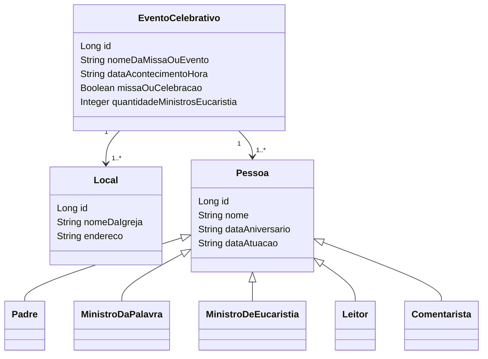

# API Evento Celebrativo

## Diagrama de Classes

```mermaid

classDiagram
  class EventoCelebrativo {
    Long id
    String nomeDaMissaOuEvento
    String dataAcontecimentoHora
    Boolean missaOuCelebracao
    Integer quantidadeMinistrosEucaristia
  }

  class Local {
    Long id
    String nomeDaIgreja
    String endereco
  }

  class Pessoa {
    Long id
    String nome
    String dataAniversario
    String dataAtuacao
  }

  class Padre
  class MinistroDaPalavra
  class MinistroDeEucaristia
  class Leitor
  class Comentarista

  EventoCelebrativo "1" --> "1..*" Local
  EventoCelebrativo "1" --> "1..*" Pessoa

  Pessoa <|-- Padre
  Pessoa <|-- MinistroDaPalavra
  Pessoa <|-- MinistroDeEucaristia
  Pessoa <|-- Leitor
  Pessoa <|-- Comentarista

```
