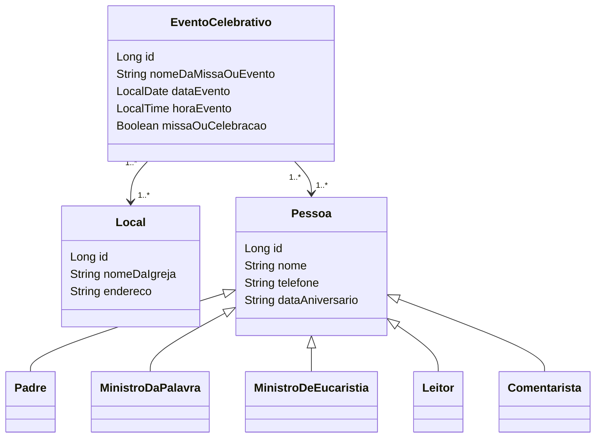

<h1 align="center"> EscalaParoquial API </h1>

## 📖 Descrição

API REST desenvolvida em Java com Spring Boot para auxiliar na organização da **Escala de Ministros** durante eventos celebrativos da **Igreja Católica Apostólica Romana**.  
Foi pensada especialmente para a realidade da minha paróquia, com o objetivo de listar mensalmente escalas de Ministros da Eucaristia, além de permitir gerenciamento completo de eventos celebrativos, locais e diversos ministérios (Leitores, Comentariastas, Padres, etc).

Este projeto **está em fase de desenvolvimento** e será expandido ao longo do tempo para contemplar mais funcionalidades, como controle de presença, relatórios e notificações.

---

## 🛠️ Tecnologias e Ferramentas Utilizadas

- **Java 21**
- **Spring Boot**
- **IntelliJ IDEA Community Edition**
- **Postman** – para testes de requisições
- **Banco de Dados**:
  - H2 (para o perfil de `test`)
  - PostgreSQL (para o perfil de `dev`)
- **Spring Data JPA**
- **Spring Security** *(planejado para futuras versões)*

---

## 🚀 Funcionalidades Resumidas

- ✅ Consultar a escala mensal dos ministros de Eucaristia
- ✅ CRUD completo de locais (igrejas)
- ✅ CRUD completo de eventos celebrativos (missas ou celebrações)
- ✅ CRUD completo de ministros: Leitores, Comentaristas, Ministros da Eucaristia, Ministros da Palavra, Padres
- 🟡 Expansão planejada: integração com notificações, geração de relatórios, controle de presença

---

## 📌 Endpoints e Casos de Uso

**URL base:** `https://localhost:8080/`

| 📝 Recurso                        | 📄 Descrição                                                     | 🔒 Acesso |
|-----------------------------------|-------------------------------------------------------------------|-----------|
| **Escala Ministros Eucaristia**   | Consultar a escala mensal dos ministros de Eucaristia             | Público    |
| **Locais (Igrejas)**              | CRUD completo de locais de celebração                             | Admin      |
| **Evento Celebrativo**            | CRUD completo de eventos religiosos                               | Admin      |
| `GET /eventos/escala/eucaristia`  | Listar escala mensal dos ministros de eucaristia                  | Público    |
| **Ministros da Palavra**          | CRUD completo                                                     | Admin      |
| **Ministros de Eucaristia**       | CRUD completo                                                     | Admin      |
| **Leitores**                      | CRUD completo                                                     | Admin      |
| **Comentaristas**                 | CRUD completo                                                     | Admin      |
| **Padres**                        | CRUD completo                                                     | Admin      |

---

## Diagrama de Classes

---

👨‍💻 Sobre o Desenvolvedor
Este projeto está sendo desenvolvido por Lucas Honorio Silva para uso em minha paróquia e para estudos pessoais em Java e Spring Boot.
Sigo aprimorando as funcionalidades aos poucos, integrando boas práticas de desenvolvimento, arquitetura limpa e testes.

