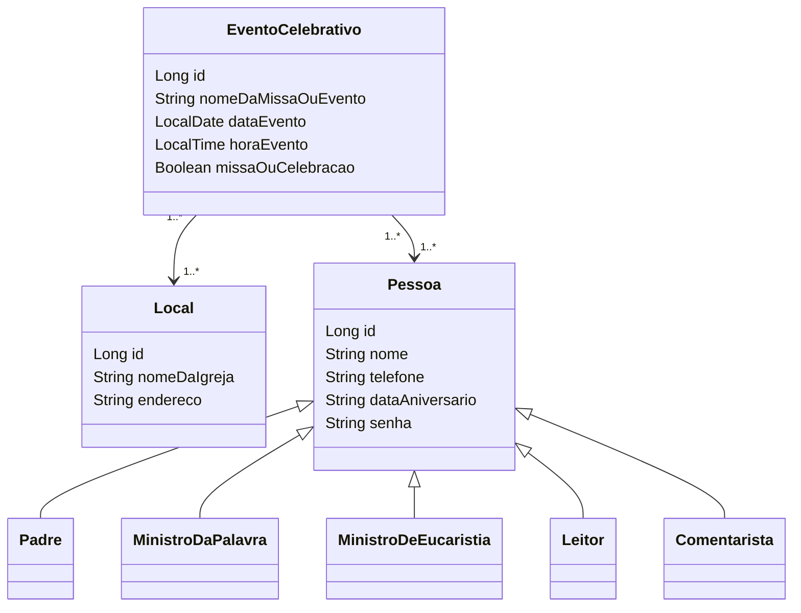

<h1 align="center">API Evento Celebrativo</h1>

API REST para gerenciamento de eventos celebrativos, pessoas, locais e escalas paroquiais da Igreja Católica Apostólica Romana.

O projeto nasceu de uma necessidade real de organização de escalas em contexto paroquial, especialmente para apoiar a montagem e consulta de escalas de ministros durante missas e celebrações. Além do uso prático, também é um projeto de estudo e evolução em Java, Spring Boot, segurança com JWT, testes automatizados e boas práticas de desenvolvimento backend.

> Status: em desenvolvimento.


---

## Tecnologias utilizadas

| Categoria | Tecnologias |
| --- | --- |
| Linguagem e framework | Java 21, Spring Boot 3.4.5 |
| Build | Maven Wrapper |
| API | Spring Web, Bean Validation |
| Persistência | Spring Data JPA, H2 Database no perfil atual |
| Segurança | Spring Security, OAuth2, JWT |
| Mapeamento | MapStruct |
| Documentação | SpringDoc OpenAPI, Swagger UI |
| Testes | JUnit 5, Mockito, MockMvc, `@DataJpaTest` |
| Testes manuais | Postman, Swagger UI |

> Observação: o backend possui driver MySQL no `pom.xml`, mas ainda não há profile/datasource real configurado para MySQL. No estado atual, o banco configurado é H2. Banco relacional real com migrations está listado como melhoria planejada.

---

## Funcionalidades

### Implementadas

- Login com token de acesso.
- Segurança com Spring Security, OAuth2 e JWT.
- Controle de acesso com `ROLE_ADMIN` e `ROLE_OPERATOR`.
- Cadastro de pessoas com senha criptografada.
- Novos usuários cadastrados pela API recebem `ROLE_OPERATOR`.
- Administração de roles por usuário `ROLE_ADMIN`.
- CRUD de eventos celebrativos.
- CRUD de locais/igrejas.
- CRUD de leitores.
- CRUD de comentaristas.
- CRUD de ministros da Eucaristia.
- CRUD de ministros da Palavra.
- CRUD de padres.
- Consulta pública de escala de ministros da Eucaristia.
- Criação de evento com escala: `POST /eventos/com-escala`.
- Atualização/montagem de escala de evento existente: `PUT /eventos/{id}/escala`.
- Tratamento de erro referencial em deletes com resposta controlada.
- Testes automatizados de service, repository e controller.
- Documentação Swagger/OpenAPI.

### Planejadas

- Integração com frontend.
- Perfis separados para `test`, `dev` e `prod`.
- Banco relacional real com migrations usando Flyway ou Liquibase.
- Remoção de secrets default antes de ambiente real.
- Remoção de hardcoded `localhost` antes de deploy.
- Relatórios.
- Controle de presença.
- Notificações.
- Métricas de cobertura com JaCoCo.
- Testes de integração mais completos.

---

## Regras de acesso e segurança

| Role | Descrição |
| --- | --- |
| `ROLE_OPERATOR` | Perfil padrão de novos usuários. Pode acessar endpoints protegidos de consulta. |
| `ROLE_ADMIN` | Pode criar, atualizar e remover recursos administrativos, montar escalas e alterar roles. |

Regras atuais:

- Usuários novos cadastrados pela API recebem `ROLE_OPERATOR`.
- Apenas `ROLE_ADMIN` pode alterar roles em `PUT /pessoas/{id}/roles`.
- Apenas `ROLE_ADMIN` pode criar, atualizar e remover recursos administrativos.
- Endpoints públicos não exigem token.
- Endpoints protegidos exigem JWT no formato Bearer Token.

---

## Endpoints públicos

| Método | Endpoint | Descrição |
| --- | --- | --- |
| `POST` | `/public/login` | Autentica usuário e retorna token de acesso. |
| `GET` | `/eventos` | Lista eventos celebrativos. |
| `GET` | `/eventos/{id}` | Busca um evento celebrativo por ID. |
| `GET` | `/eventos/escala/eucaristia` | Consulta escala pública de ministros da Eucaristia por período. |

---

## Endpoints que exigem autenticação

| Método | Endpoint | Descrição |
| --- | --- | --- |
| `GET` | `/locais` | Lista locais/igrejas. |
| `GET` | `/leitores` | Lista leitores. |
| `GET` | `/comentaristas` | Lista comentaristas. |
| `GET` | `/ministrosDeEucaristia` | Lista ministros da Eucaristia. |
| `GET` | `/ministrosDaPalavra` | Lista ministros da Palavra. |
| `GET` | `/padres` | Lista padres. |

---

## Endpoints administrativos

Exigem autenticação com `ROLE_ADMIN`.

| Método | Endpoint | Descrição |
| --- | --- | --- |
| `POST` | `/eventos`, `/locais`, `/leitores`, `/comentaristas`, `/ministrosDeEucaristia`, `/ministrosDaPalavra`, `/padres` | Cria recursos administrativos. |
| `PUT` | `/eventos/{id}`, `/locais/{id}`, `/leitores/{id}`, `/comentaristas/{id}`, `/ministrosDeEucaristia/{id}`, `/ministrosDaPalavra/{id}`, `/padres/{id}` | Atualiza recursos administrativos. |
| `DELETE` | `/eventos/{id}`, `/locais/{id}`, `/leitores/{id}`, `/comentaristas/{id}`, `/ministrosDeEucaristia/{id}`, `/ministrosDaPalavra/{id}`, `/padres/{id}` | Remove recursos administrativos. |
| `PUT` | `/pessoas/{id}/roles` | Altera a role de uma pessoa. |
| `POST` | `/eventos/com-escala` | Cria evento celebrativo com escala. |
| `PUT` | `/eventos/{id}/escala` | Atualiza/monta a escala de um evento existente. |

---

## Pré-requisitos

- Java 21 instalado
- Git instalado
- IDE de sua preferência, como IntelliJ IDEA
- Postman opcional para testes manuais

---

## Como rodar o projeto

Execute os comandos a partir da pasta do backend:

```powershell
cd backend\evento-celebrativo-api
.\mvnw.cmd clean compile
.\mvnw.cmd spring-boot:run
```

URL base local:

```text
http://localhost:8080
```

---

## Como rodar os testes

```powershell
cd backend\evento-celebrativo-api
.\mvnw.cmd test
.\mvnw.cmd -q test
```

---

## Documentação Swagger/OpenAPI

Com a aplicação em execução, acesse:

```text
http://localhost:8080/swagger-ui/index.html
http://localhost:8080/v3/api-docs
```

O Swagger permite visualizar os endpoints da API, consultar contratos de entrada/saída e testar requisições manualmente. Para endpoints protegidos, informe o token JWT no botão de autorização da interface.

---

## Fluxo básico de autenticação

Endpoint:

```http
POST /public/login
```

Payload:

```json
{
  "username": "telefone_do_usuario",
  "password": "senha"
}
```

O token retornado deve ser usado nos endpoints protegidos com o header:

```http
Authorization: Bearer seu_token_jwt
```

---

## Exemplos de payload

### Criar evento

Endpoint:

```http
POST /eventos
```

Payload:

```json
{
  "nameMassOrEvent": "Missa de Domingo",
  "eventDate": "2026-08-15",
  "eventTime": "19:30:00",
  "massOrCelebration": true
}
```

### Criar evento com escala

Endpoint:

```http
POST /eventos/com-escala
```

Payload:

```json
{
  "nameMassOrEvent": "Missa de Domingo",
  "eventDate": "2026-08-15",
  "eventTime": "19:30:00",
  "massOrCelebration": true,
  "locationId": 1,
  "priestId": 13,
  "readerIds": [4, 5],
  "commentatorIds": [1],
  "ministerOfTheWordIds": [7],
  "eucharisticMinisterIds": [10, 11]
}
```

### Atualizar escala de evento

Endpoint:

```http
PUT /eventos/{id}/escala
```

Payload:

```json
{
  "locationId": 2,
  "priestId": 14,
  "readerIds": [5, 6],
  "commentatorIds": [2],
  "ministerOfTheWordIds": [8],
  "eucharisticMinisterIds": [11, 12]
}
```

### Alterar role de pessoa

Endpoint:

```http
PUT /pessoas/{id}/roles
```

Payload:

```json
{
  "role": "ROLE_ADMIN"
}
```

---

## Testes

O projeto possui testes automatizados cobrindo as principais camadas:

- Testes de service com Mockito.
- Testes de repository com `@DataJpaTest`.
- Testes de controller com MockMvc.
- Testes de regras de segurança dos endpoints.

---

## Diagrama conceitual de classes


```mermaid
classDiagram
  class EventoCelebrativo {
    Long id
    String nomeDaMissaOuEvento
    LocalDate dataEvento
    LocalTime horaEvento
    Boolean missaOuCelebracao
  }

  class Local {
    Long id
    String nomeDaIgreja
    String endereco
  }

  class Pessoa {
    Long id
    String nome
    String telefone
    String dataAniversario
    String senha
  }

  class Padre
  class MinistroDaPalavra
  class MinistroDeEucaristia
  class Leitor
  class Comentarista

  EventoCelebrativo "1..*" --> "1..*" Local
  EventoCelebrativo "1..*" --> "1..*" Pessoa

  Pessoa <|-- Padre
  Pessoa <|-- MinistroDaPalavra
  Pessoa <|-- MinistroDeEucaristia
  Pessoa <|-- Leitor
  Pessoa <|-- Comentarista
```

---

## Sobre o desenvolvedor

Desenvolvido por Lucas Honório Silva.

Este projeto une uma demanda real de organização paroquial com estudos pessoais e profissionais em Java, Spring Boot, APIs REST, segurança, testes automatizados e documentação de software.
