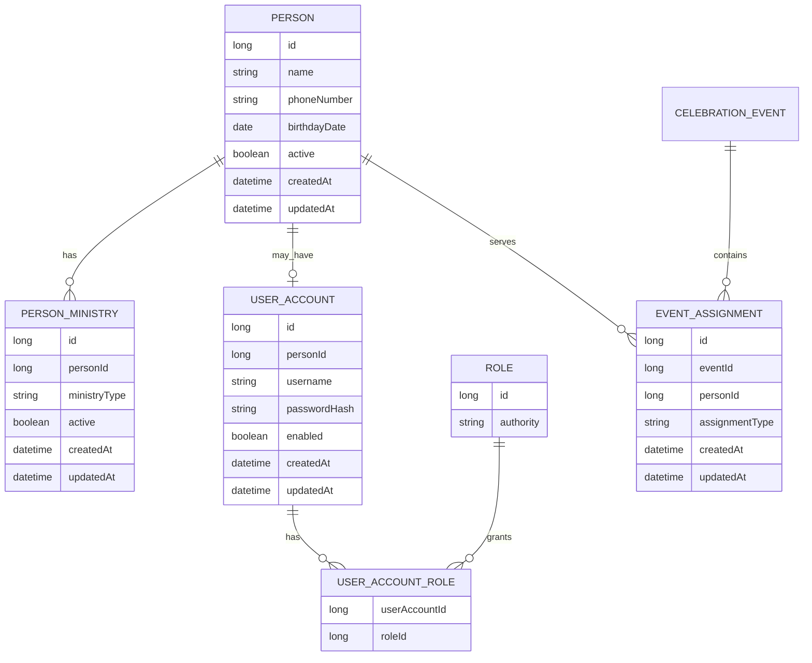

# ADR 0001: Separar Pessoa, Funcoes Ministeriais, Conta de Acesso e Participacao em Escalas

## 1. Status

Accepted

Data de aceitacao: 2026-07-17

## 2. Contexto

### Fatos confirmados no codigo atual

- `Person` e uma entidade abstrata com `@Inheritance(strategy = InheritanceType.SINGLE_TABLE)` e `@DiscriminatorColumn(name = "person_type")`.
- As subclasses `Reader`, `Commentator`, `Priest`, `MinisterOfTheWord` e `EucharisticMinister` usam `@DiscriminatorValue` com os valores reais `reader`, `commentator`, `priest`, `minister_of_the_word` e `eucharistic_minister`.
- `Person` implementa `UserDetails`, possui `password`, `roles`, `phoneNumber`, `birthdayDate` e `personType`.
- As subclasses implementam `getUsername()` retornando `getPhoneNumber()` e os metodos de conta como sempre ativos.
- `Role` implementa `GrantedAuthority` e e associada a `Person` por `tb_person_role`.
- `PersonDetailsServiceImpl` autentica buscando `Person` por `phoneNumber`.
- `AuthorizationServerConfig` emite JWT com claims `authorities` e `username` a partir de `UserDetails`.
- `PublicController` faz proxy de `POST /public/login` para `/oauth2/token`, usando grant `password`.
- Os CRUDs ministeriais sao separados por subtipo e repository: `ReaderRepository`, `CommentatorRepository`, `PriestRepository`, `MinisterOfTheWordRepository` e `EucharisticMinisterRepository`.
- Os services de cadastro de pessoas ministeriais criptografam senha e adicionam `ROLE_OPERATOR` por padrao.
- A administracao atual de pessoas usa `GET /pessoas`, `GET /pessoas/{id}` e `PUT /pessoas/{id}/roles`; o update de role substitui a colecao atual por uma unica role solicitada.
- O codigo protege autodespromocao administrativa e ultimo administrador no fluxo atual de `PUT /pessoas/{id}/roles`.
- `CelebrationEvent` possui `List<Person> people` em `tb_event_person` e `List<Location> locations` em `tb_event_location`.
- A escala atual nao possui entidade propria; a funcao exercida e inferida pelo subtipo Java ou por `person_type`.
- `POST /eventos/com-escala` e `PUT /eventos/{id}/escala` recebem IDs separados por funcao, validam o subtipo esperado e substituem completamente os vinculos de local e pessoas do evento.
- O service impede a mesma pessoa em mais de uma funcao na mesma escala usando `usedPersonIds`.
- A consulta mensal `GET /eventos/escalas` usa `EventScheduleType` e consultas nativas filtrando `tb_person.person_type`.
- O detalhe `GET /eventos/{id}/escala` separa participantes por subtipo com `Class::isInstance`.
- `CelebrationEventScaleMapper` tambem usa subtipo Java para montar listas por funcao.
- `EucharistScaleEventResponseDTO` ainda contem construtor legado que filtra `personType` e acessa `locations.get(0)`.
- O `pom.xml` contem Spring Data JPA, H2, MySQL connector, Spring Security, OAuth2 Authorization Server, OAuth2 Resource Server, MapStruct e Bean Validation.
- Nao ha dependencia Flyway ou Liquibase no `pom.xml`, nem pasta de migrations observada.
- Profiles atuais usam H2 com `ddl-auto=create` e `spring.sql.init.mode=always` nos ambientes `local` e `test`.

### Consequencia do desenho atual

O modelo atual usa heranca JPA como classificacao ministerial, autentica a propria pessoa, armazena credenciais junto a dados pessoais e usa o subtipo para interpretar a escala. Isso funcionou para a primeira versao, mas acopla quatro conceitos que evoluem de formas diferentes:

- pessoa fisica;
- funcao ministerial habilitada;
- conta de acesso;
- funcao exercida em um evento especifico.

Tambem ha duplicacao estrutural nos cinco CRUDs e risco operacional se alguem tentar "trocar" `person_type` diretamente, porque isso muda a classe JPA, o repository esperado e a interpretacao historica das escalas.

Durante qualquer migracao, contratos existentes precisam continuar funcionando para nao quebrar frontend, testes e fluxos ja validados.

## 3. Problema

Os conceitos abaixo nao devem continuar misturados:

- Dados pessoais: nome, telefone, nascimento e status civil/operacional da pessoa fisica.
- Funcao ministerial: habilitacoes que a pessoa pode exercer, possivelmente mais de uma.
- Acesso ao sistema: username, senha, status da conta e roles de seguranca.
- Funcao exercida em um evento: atribuicao historica e contextual de uma pessoa a uma funcao em uma celebracao.

Quando esses conceitos ficam no mesmo objeto, surgem efeitos colaterais:

- uma pessoa sem necessidade de login ainda precisa de senha no contrato atual;
- uma pessoa com multiplas funcoes nao cabe naturalmente em uma unica subclasse;
- remover ou alterar uma funcao ministerial pode reescrever a interpretacao historica de escalas;
- trocar acesso administrativo pode parecer mudanca de pessoa;
- consultas de escala precisam depender de `instanceof` ou `person_type`;
- a migracao para um modelo mais rico fica arriscada se comecar com alteracoes destrutivas.

## 4. Decisoes aceitas

### Pessoa

- `Person` representa a pessoa fisica.
- Uma pessoa pode possuir zero, uma ou varias funcoes ministeriais.
- Pessoa possui status ativo/inativo.
- Desativacao e preferida a exclusao definitiva.
- Pessoa inativa permanece no historico.
- Pessoa inativa permanece visivel em consultas e escalas historicas.
- Pessoa inativa nao pode ser selecionada em novas escalas.

### Funcoes ministeriais

Tipos iniciais:

```text
PRIEST
READER
COMMENTATOR
MINISTER_OF_THE_WORD
EUCHARISTIC_MINISTER
```

- Funcoes sao associadas por composicao.
- Nao existe mais "trocar o tipo da pessoa".
- O conjunto de funcoes pode ser atualizado de forma idempotente.
- Na primeira versao, nao adicionar periodo de validade, pois nao ha requisito confirmado no codigo atual.
- Padre pode possuir outras funcoes ministeriais; o modelo nao deve criar restricao especifica sem requisito operacional confirmado.

### Conta de acesso

- Conta de acesso e opcional.
- Nem toda pessoa precisa fazer login.
- Conta possui username, hash da senha, status e roles.
- Pessoa e conta podem ser desativadas separadamente.
- Conta desativada nao pode autenticar.
- Pessoa inativa nao pode autenticar, mesmo que sua conta esteja habilitada.
- O telefone permanece inicialmente como username por compatibilidade.
- O novo modelo deve possuir campo proprio de username para reduzir o acoplamento futuro.
- Auditoria completa de alteracoes nao bloqueia a primeira migracao.
- As novas estruturas devem possuir `createdAt` e `updatedAt`, preparando evolucao futura.

### Escalas

- A funcao exercida em cada evento deve ser armazenada explicitamente.
- Criar futuramente o conceito `EventAssignment`.
- Uma pessoa so pode ser escalada em uma funcao para a qual esteja habilitada.
- Escalas historicas devem ser preservadas.
- Remover uma funcao nao deve apagar atribuicoes historicas.
- Uma funcao usada somente em eventos passados pode ser removida da lista de funcoes habilitadas da pessoa.
- Essa remocao nao pode apagar ou modificar atribuicoes historicas.
- Uma funcao nao pode ser removida enquanto estiver usada em escala futura.
- A mesma pessoa nao pode exercer duas funcoes diferentes no mesmo evento nesta primeira versao, preservando a regra atual.
- A mesma pessoa pode exercer funcoes diferentes em eventos distintos.

## 5. Questoes aprovadas

| Questao | Recomendacao inicial | Estado |
| ------- | -------------------- | ------ |
| Uma pessoa pode exercer mais de uma funcao? | Sim. | Aprovada |
| Toda pessoa precisa de conta? | Nao. | Aprovada |
| Telefone continuara sendo username? | Sim inicialmente, com campo proprio na conta. | Aprovada |
| Padre pode possuir outras funcoes? | O modelo permite; regra operacional ainda precisa ser confirmada antes de restringir. | Aprovada |
| Funcoes precisam de data inicial/final? | Nao na primeira versao. | Aprovada |
| Pessoa pode ser desativada? | Sim. | Aprovada |
| Conta pode ser desativada separadamente? | Sim. | Aprovada |
| Deve existir auditoria completa de alteracoes? | Nao bloquear a primeira migracao; preparar timestamps. | Aprovada |
| Uma funcao usada no passado pode ser removida? | Sim, sem apagar ou modificar o historico. | Aprovada |
| Uma funcao usada em escala futura pode ser removida? | Bloquear enquanto houver atribuicao futura. | Aprovada |
| A mesma pessoa pode exercer duas funcoes no mesmo evento? | Manter a proibicao atual nesta primeira versao. | Aprovada |
| A mesma pessoa pode exercer funcoes diferentes em eventos distintos? | Sim. | Aprovada |
| Pessoa inativa deve aparecer em consultas historicas? | Sim. | Aprovada |
| Pessoa inativa deve aparecer como opcao para novas escalas? | Nao. | Aprovada |

### Pendencias futuras sem bloquear a primeira migracao

- Validade temporal de funcoes ministeriais.
- Auditoria completa com trilha detalhada e usuario responsavel por cada alteracao.
- Permitir duas funcoes para a mesma pessoa no mesmo evento.
- Trocar username independentemente do telefone.
- Exclusao fisica de pessoas.
- Remocao definitiva das estruturas legadas.

## 6. Modelo conceitual proposto

```text
Person
- id
- name
- phoneNumber
- birthdayDate
- active
- createdAt
- updatedAt
```

`Person` pode existir sem `UserAccount`. Uma pessoa tambem pode existir sem funcao ministerial habilitada e pode possuir varias entradas em `PersonMinistry`.

```text
PersonMinistry
- id
- personId
- ministryType
- active
- createdAt
- updatedAt
```

`PersonMinistry` representa uma funcao ministerial habilitada para a pessoa. A funcao exercida em uma escala deve estar habilitada em `PersonMinistry` no momento da criacao ou alteracao da escala.

```text
UserAccount
- id
- personId
- username
- passwordHash
- enabled
- createdAt
- updatedAt
```

`UserAccount` e opcional e representa exclusivamente autenticacao e autorizacao de acesso ao sistema. O campo `username` existe mesmo que inicialmente receba o telefone por compatibilidade.

```text
UserAccountRole
- userAccountId
- roleId
```

`EventAssignment.assignmentType` representa a funcao exercida pela pessoa naquele evento. O historico de `EventAssignment` permanece mesmo apos a remocao ou inativacao posterior da funcao habilitada em `PersonMinistry`.

```text
EventAssignment
- id
- eventId
- personId
- assignmentType
- createdAt
- updatedAt
```



## 7. Restricoes e invariantes propostas

- Telefone unico enquanto for identificador principal.
- Username unico.
- Uma conta por pessoa.
- Combinacao unica pessoa/funcao ministerial.
- Combinacao unica `eventId + personId + assignmentType`.
- Manter inicialmente a restricao de uma unica funcao por pessoa no mesmo evento; avaliar `UNIQUE(event_id, person_id)` enquanto essa regra existir.
- Somente `ROLE_ADMIN` e `ROLE_OPERATOR`.
- Ultimo administrador protegido.
- Autodespromocao protegida.
- Hashes atuais preservados integralmente e sem recriptografia.
- Nenhuma credencial em DTOs.
- Pessoa sem funcao e permitida.
- Pessoa sem conta e permitida.
- Pessoa inativa nao pode autenticar.
- Conta desativada nao pode autenticar.
- Pessoa inativa nao deve aparecer como opcao para novas escalas.
- Pessoa inativa deve aparecer em consultas historicas.
- Atribuicao em escala exige funcao ministerial habilitada.
- Atribuicoes historicas nao sao apagadas ao remover uma funcao habilitada.
- Funcao usada em escala futura nao pode ser removida.

## 8. Compatibilidade

Inicialmente devem permanecer:

```text
/leitores
/comentaristas
/padres
/ministrosDaPalavra
/ministrosDeEucaristia
GET /pessoas
GET /pessoas/{id}
PUT /pessoas/{id}/roles
GET /eventos/escalas
GET /eventos/{id}/escala
POST /eventos/com-escala
PUT /eventos/{id}/escala
```

- Endpoints antigos nao serao removidos imediatamente.
- Contratos atuais devem continuar funcionando.
- A migracao deve comecar com estruturas aditivas.
- Tabelas e colunas antigas nao devem ser removidas nas primeiras etapas.
- Nao remover `person_type`, senha, roles ou vinculos atuais nas primeiras etapas.
- O frontend nao sera obrigado a migrar junto com a primeira mudanca de banco.
- A primeira versao pode manter dual-read ou adapters para os contratos antigos.
- A escrita em estruturas novas deve ser introduzida com feature flags ou passos controlados quando houver risco de divergencia.
- A versao anterior da aplicacao deve continuar compativel com o schema expandido.

## 9. Estrategia incremental

1. ADR e decisoes aceitas.
2. Definicao do banco-alvo e estrategia de Flyway/baseline.
3. Flyway e baseline.
4. Tabelas paralelas.
5. Backfill e auditoria.
6. Migrar escalas para `EventAssignment`.
7. Migrar autenticacao para `UserAccount`.
8. Remover dependencia das subclasses.
9. Criar API unificada.
10. Migrar frontend.
11. Depreciar contratos antigos.
12. Remover estruturas legadas somente apos periodo de estabilizacao.

## 10. Riscos

- Perda de administradores.
- Perda de hashes.
- Perda de historico.
- Divergencia entre tabelas antigas e novas.
- Diferencas H2 versus banco real.
- Quebra do JWT/login.
- `MultipleBagFetchException` se multiplas listas forem carregadas com fetch join no mesmo grafo.
- N+1 ao carregar ministerios, contas, roles ou atribuicoes.
- Inconsistencia durante dual-write.
- Conversao prematura da heranca.
- Migrations destrutivas.
- Regras de negocio antigas e novas divergindo durante a transicao.
- `person_type` antigo continuar sendo usado por consultas apos a migracao de escalas.

## 11. Rollback

- Migrations inicialmente aditivas.
- Backup antes do backfill.
- Tabelas antigas preservadas.
- Versao anterior da aplicacao compativel com schema expandido.
- Backfills com consultas de auditoria.
- Comparacao de contagens e vinculos.
- Hashes copiados sem alteracao.
- Nenhuma migration destrutiva antes da estabilizacao do novo frontend e backend.
- Possibilidade de voltar a ler estruturas antigas.
- Backfill deve ser repetivel ou possuir marcadores de execucao.
- Dual-write deve registrar divergencias antes de ser fonte exclusiva.

## 12. Criterios de aceite atendidos

Este ADR foi aceito em 2026-07-17 apos aprovacao das decisoes sobre:

- regras da secao de questoes abertas;
- politica de desativacao;
- politica de funcoes usadas em eventos futuros;
- regra de multiplas funcoes no mesmo evento;
- estrategia de compatibilidade;
- estrategia inicial de migrations aditivas e rollback.

Ainda permanecem fora do escopo imediato a escolha do banco-alvo e a implementacao de Flyway/baseline.

## Decisoes adiadas

- Banco-alvo definitivo para a migracao.
- Validade temporal de funcoes ministeriais.
- Auditoria completa.
- Permitir duas funcoes para a mesma pessoa no mesmo evento.
- Trocar username independente do telefone.
- Exclusao fisica de pessoas.
- Remocao definitiva das estruturas legadas.
- Se `EventAssignment` tera ordenacao manual por funcao.
- Se endpoints antigos serao adaptados por facade ou mantidos por services separados ate a remocao.
- Se a senha sera obrigatoria ao criar uma pessoa sem conta no novo modelo.
